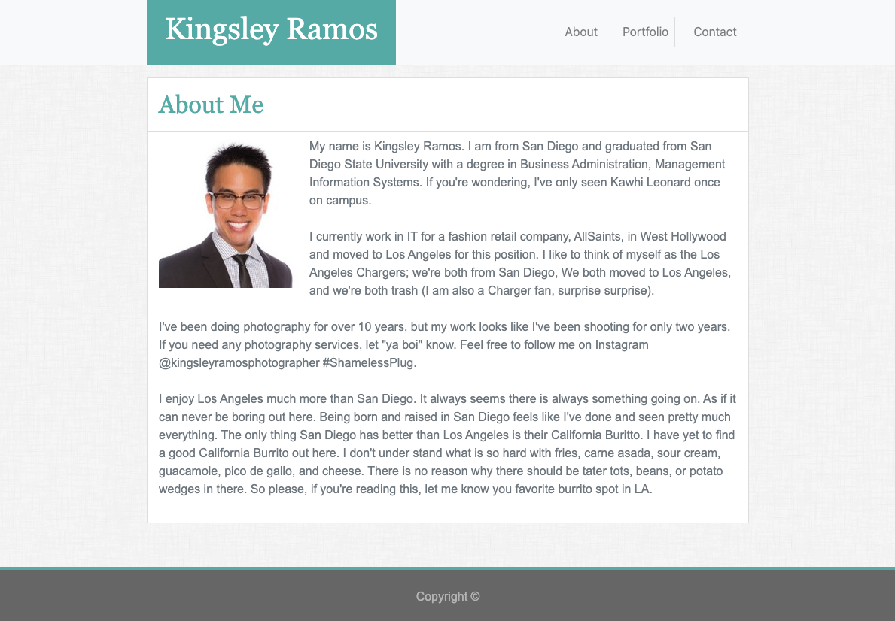

# Assignment 2: Responsive-Portfolio

For this assignment, we were tasked to create a website from scratch with using Bootstrap components and create a responsive website that changes according to screen width.

## Click [Here](https://kingsleyramos.github.io/Responsive-Portfolio/) for deployed site
---

This is the home page on the desktop:

This is the home page when on mobile:

## Tool & Resources
---
* [Bootstrap](https://getbootstrap.com/) - CSS framework used

## Challenges

The largest challenge was trying to understand how and if I should override some bootstrap components. The homework instructions were not very clear so I had to refer to other classmates if they purely used bootstrap or used custom CSS along with bootstrap. I have found that many of them used custom CSS to override some CSS. 

## Take Away

I've learned how to use the Inspect tool to learn which attributes within bootstrap I can override with my own CSS. After doing this project, I got to understand prioritization within HTML and CSS, as well as create responsive website according to screen size and use media queries.
